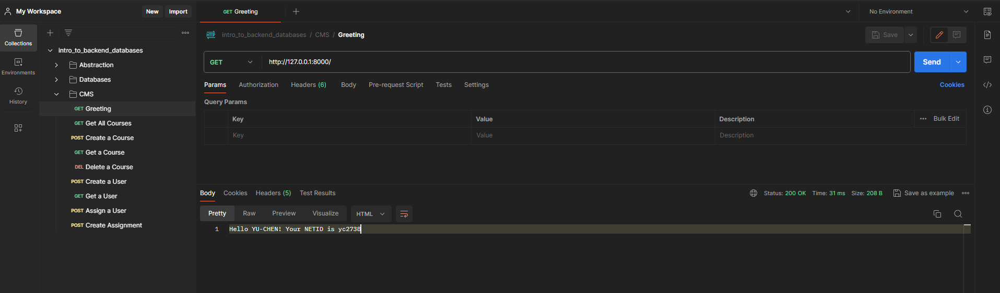

# Course Manage System Design

Building a Course Management System Manager. The functionality includes assigning instructors to courses to manage assignments as well as students.  

I build the system with Python Flask and SQL, and build the image and the container for this system using Docker.

